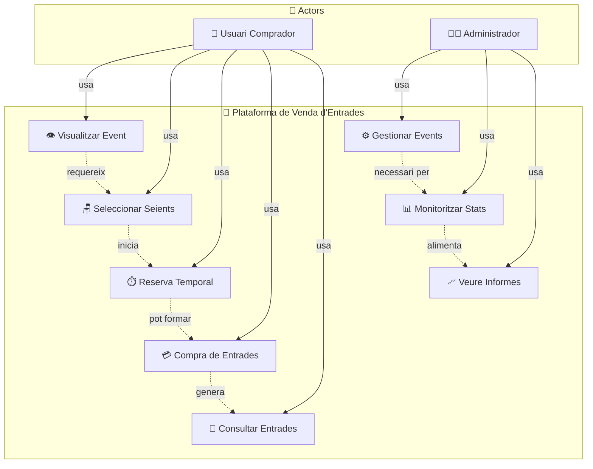
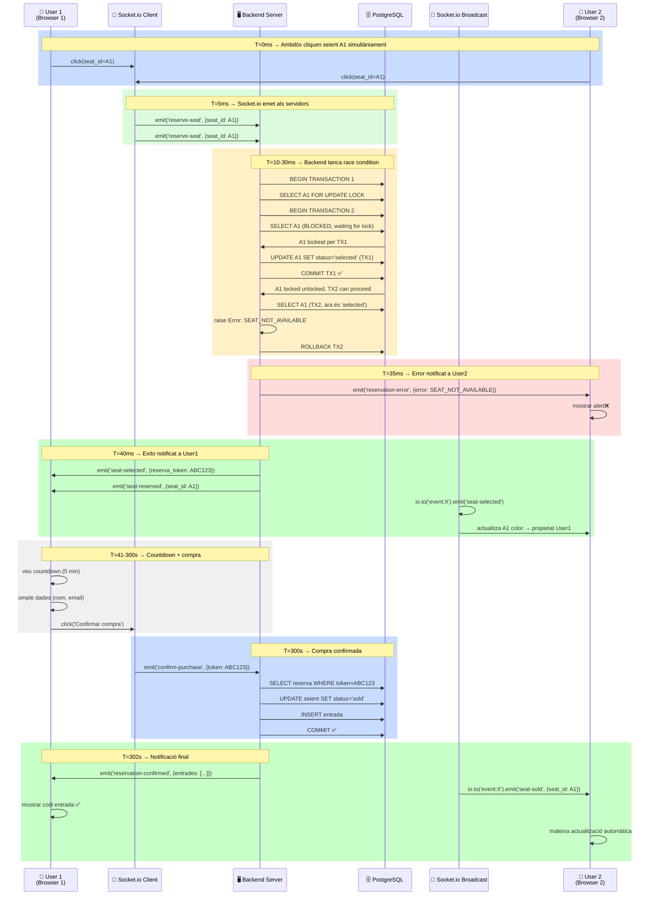
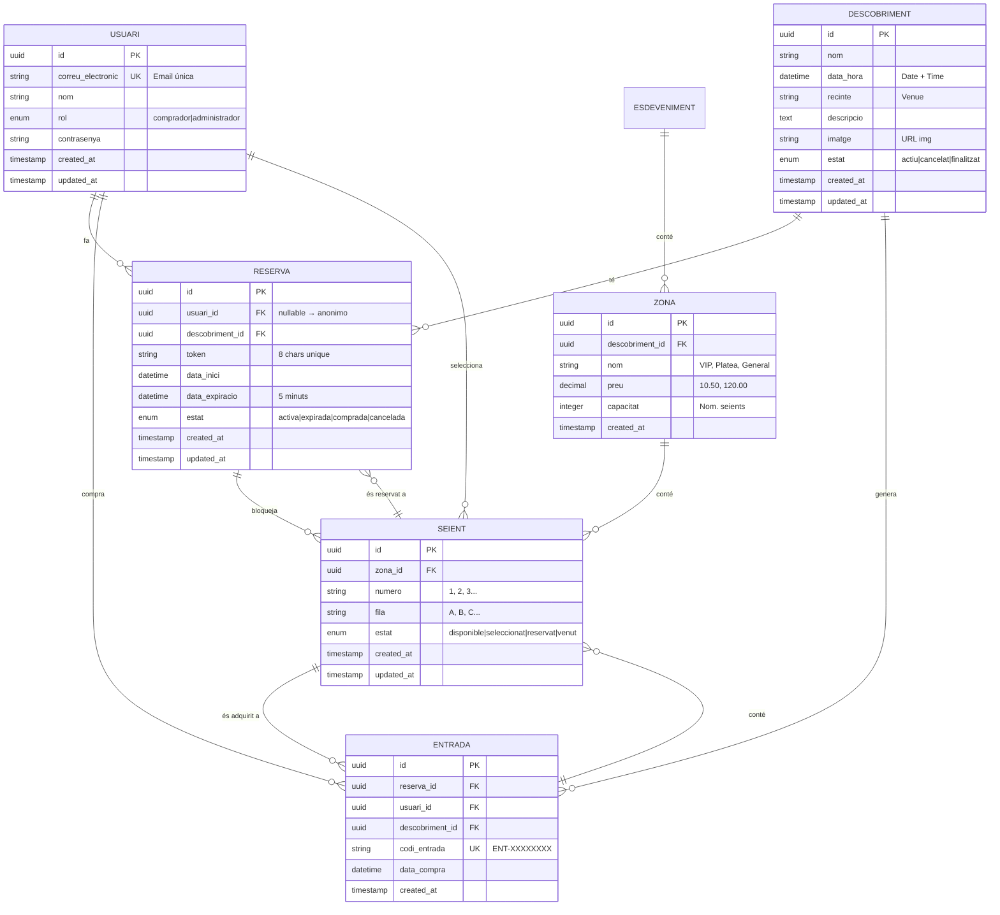
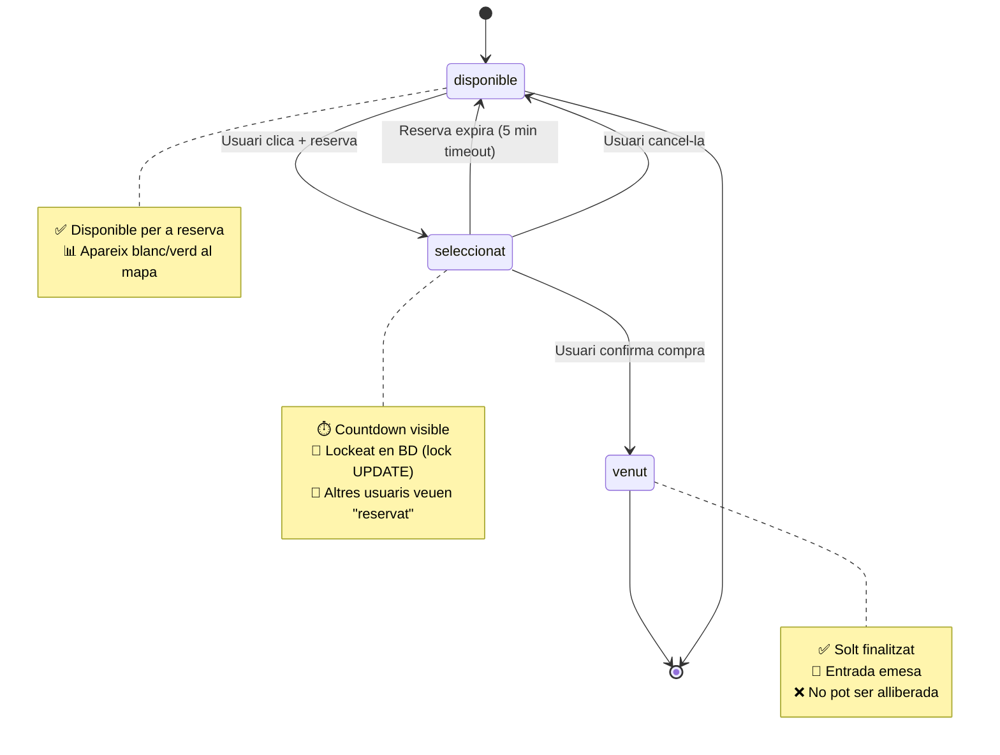
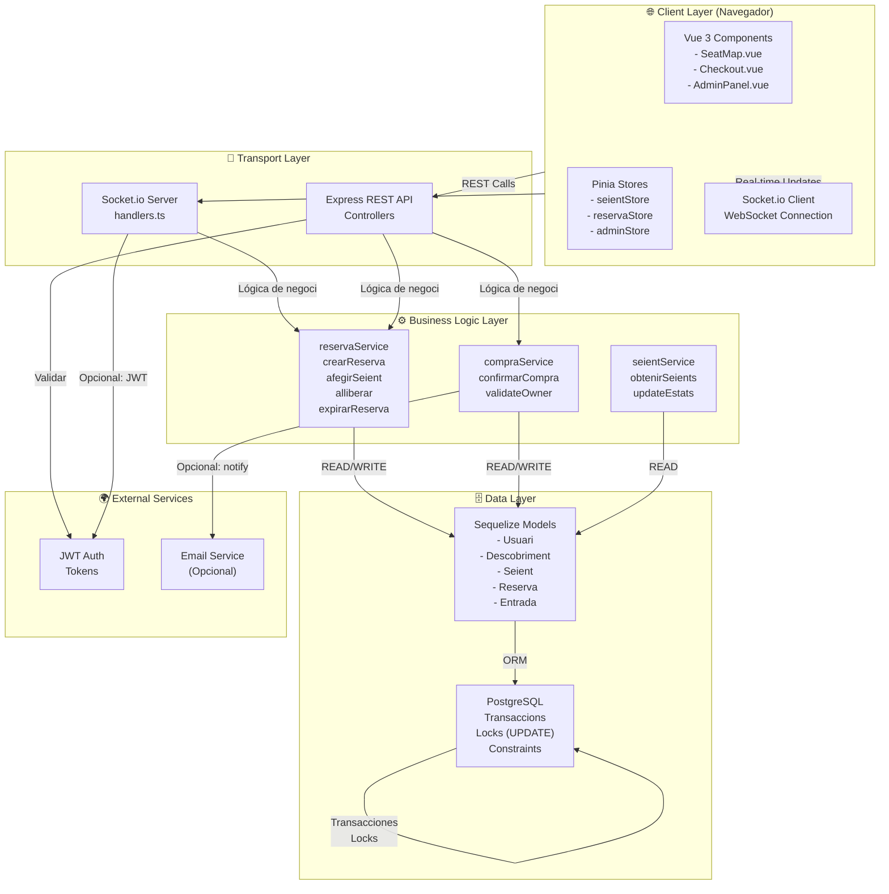

# Diagrames del Projecte: Plataforma de Venda d'Entrades

## 1. Diagram de Casos d'Ús



---

## 2. Diagram de Flux de Reserva i Compra (Concurrència)



---

## 3. Diagram Entitat-Relació (ER)



---

## 4. State Machine: Estat d'un Seient



---

## 5. Architecture Diagram: Sistema Complet



---

## 6. Timeline de Concurrència: Cas Llindar

```mermaid
graph LR
    T0["T=0ms<br/>👤 User1: Click A1<br/>👤 User2: Click A1"]
    T5["T=5ms<br/>🔌 Socket.io<br/>emet events"]
    T10["T=10ms<br/>🖥️ TX1 LOCK A1<br/>🖥️ TX2 ESPERA"]
    T15["T=15ms<br/>🖥️ TX1 UPDATE<br/>A1→'selected'"]
    T20["T=20ms<br/>🖥️ TX1 COMMIT<br/>🔓 Lock liberalitzat"]
    T25["T=25ms<br/>🖥️ TX2 VEU A1<br/>ja es selected"]
    T30["T=30ms<br/>🖥️ TX2 ERROR<br/>SEAT_NOT_AVAILABLE"]
    T35["T=35ms<br/>📡 Socket notifica<br/>tots els clients"]
    T40["T=40ms<br/>✅ User1: Reserva OK<br/>❌ User2: Error"]
    
    T0 --> T5 --> T10 --> T15 --> T20 --> T25 --> T30 --> T35 --> T40
    
    style T0 fill:#ff9999
    style T10 fill:#ffcc99
    style T20 fill:#99ff99
    style T30 fill:#ff9999
    style T40 fill:#99ff99,#ff9999
```



---

## 7. Database Schema (SQL)

```sql
-- USUARI: Compradors i administradors
CREATE TABLE usuari (
    id UUID PRIMARY KEY DEFAULT uuid_generate_v4(),
    correu_electronic VARCHAR(255) UNIQUE NOT NULL,
    nom VARCHAR(100) NOT NULL,
    rol VARCHAR(20) CHECK (rol IN ('comprador', 'administrador')) DEFAULT 'comprador',
    contrasenya VARCHAR(255),
    created_at TIMESTAMP DEFAULT CURRENT_TIMESTAMP,
    updated_at TIMESTAMP DEFAULT CURRENT_TIMESTAMP
);

-- DESCOBRIMENT: Concerts, festivals, etc.
CREATE TABLE descobriment (
    id UUID PRIMARY KEY DEFAULT uuid_generate_v4(),
    nom VARCHAR(200) NOT NULL,
    data_hora TIMESTAMP NOT NULL,
    recinte VARCHAR(200) NOT NULL,
    descripcio TEXT,
    imatge VARCHAR(500),
    estat VARCHAR(20) CHECK (estat IN ('actiu', 'cancelat', 'finalitzat')) DEFAULT 'actiu',
    created_at TIMESTAMP DEFAULT CURRENT_TIMESTAMP,
    updated_at TIMESTAMP DEFAULT CURRENT_TIMESTAMP
);

-- ZONA: Sections amb preus
CREATE TABLE zona (
    id UUID PRIMARY KEY DEFAULT uuid_generate_v4(),
    descobriment_id UUID NOT NULL REFERENCES descobriment(id),
    nom VARCHAR(100) NOT NULL,
    preu DECIMAL(10,2) NOT NULL CHECK (preu >= 0),
    capacitat INTEGER NOT NULL CHECK (capacitat > 0),
    created_at TIMESTAMP DEFAULT CURRENT_TIMESTAMP
);

-- SEIENT: Individual seat
CREATE TABLE seient (
    id UUID PRIMARY KEY DEFAULT uuid_generate_v4(),
    zona_id UUID NOT NULL REFERENCES zona(id),
    numero VARCHAR(10) NOT NULL,
    fila VARCHAR(10) NOT NULL,
    estat VARCHAR(20) DEFAULT 'disponible' 
        CHECK (estat IN ('disponible', 'seleccionat', 'reservat', 'venut')),
    created_at TIMESTAMP DEFAULT CURRENT_TIMESTAMP,
    updated_at TIMESTAMP DEFAULT CURRENT_TIMESTAMP,
    UNIQUE(zona_id, fila, numero)
);

-- INDEX para velocidad
CREATE INDEX idx_seient_zona ON seient(zona_id);
CREATE INDEX idx_seient_estat ON seient(estat);

-- RESERVA: Temporary holds (5 min)
CREATE TABLE reserva (
    id UUID PRIMARY KEY DEFAULT uuid_generate_v4(),
    usuari_id UUID REFERENCES usuari(id),
    descobriment_id UUID NOT NULL REFERENCES descobriment(id),
    token VARCHAR(50) UNIQUE NOT NULL,
    data_inici TIMESTAMP NOT NULL,
    data_expiracio TIMESTAMP NOT NULL,
    estat VARCHAR(20) DEFAULT 'activa'
        CHECK (estat IN ('activa', 'expirada', 'comprada', 'cancelada')),
    created_at TIMESTAMP DEFAULT CURRENT_TIMESTAMP,
    updated_at TIMESTAMP DEFAULT CURRENT_TIMESTAMP
);

-- M2M: Reserva ↔ Seients
CREATE TABLE reserva_seient (
    reserva_id UUID PRIMARY KEY REFERENCES reserva(id),
    seient_id UUID PRIMARY KEY REFERENCES seient(id)
);

-- ENTRADA: Issued ticket
CREATE TABLE entrada (
    id UUID PRIMARY KEY DEFAULT uuid_generate_v4(),
    reserva_id UUID REFERENCES reserva(id),
    usuari_id UUID REFERENCES usuari(id),
    descobriment_id UUID NOT NULL REFERENCES descobriment(id),
    codi_entrada VARCHAR(50) UNIQUE NOT NULL,
    data_compra TIMESTAMP NOT NULL,
    created_at TIMESTAMP DEFAULT CURRENT_TIMESTAMP
);

-- M2M: Entrada ↔ Seients
CREATE TABLE entrada_seient (
    entrada_id UUID PRIMARY KEY REFERENCES entrada(id),
    seient_id UUID PRIMARY KEY REFERENCES seient(id)
);
```

---

## Resum Visual: Fluxo Complet

```
┌─────────────────────────────────────────────────────────────────┐
│  USUARI ANÓNIM → LOGIN → EVENT DETAIL → SEIENT SELECTION         │
├─────────────────────────────────────────────────────────────────┤
│                                                                   │
│  1. VISUALITZAR EVENT                                             │
│     └─ GET /api/events/:id                                        │
│     └─ Socket.io: join-event → obté tots els seients             │
│                                                                   │
│  2. SELECCIONAR SEIENT (Crear Reserva)                           │
│     └─ Socket.io: reserve-seat                                    │
│     └─ Backend: BEGIN TRANSACTION → LOCK SEIENT → UPDATE STATUS  │
│     └─ Socket.io: BROADCAST seat-selected a tots els clients     │
│     └─ Frontend: Mostrar COUNTDOWN 5 minuts                       │
│                                                                   │
│  3. EXPIRACIÓ (Opcional)                                         │
│     └─ Después de 5 min: socket-io emet reservation-expired      │
│     └─ Seient torna a 'disponible'                               │
│                                                                   │
│  4. COMPRAR (Opcional)                                           │
│     └─ Usuario omple dades (nom, email)                          │
│     └─ Socket.io: confirm-purchase                                │
│     └─ Backend: UPDATE seient='sold' + INSERT entrada             │
│     └─ Socket.io: BROADCAST seat-sold a tots                     │
│     └─ Frontend: Mostrar CODI ENTRADA                             │
│                                                                   │
│  5. CONSULTAR ENTRADES (Posterior)                               │
│     └─ GET /api/entrades?email=user@example.com                  │
│     └─ Mostrar totes les entrades de l'usuari                    │
│                                                                   │
│  [ADMIN PANEL - Opcional]                                        │
│     └─ GET /api/admin/events/:id/stats                            │
│     └─ GET /api/admin/events/:id/report                           │
│     └─ Mostrar: seients per estat, ocupació %, reserves actives   │
│                                                                   │
└─────────────────────────────────────────────────────────────────┘
```

---

**Diagrams generats amb Mermaid.js - Renderble en GitHub/Markdown**
